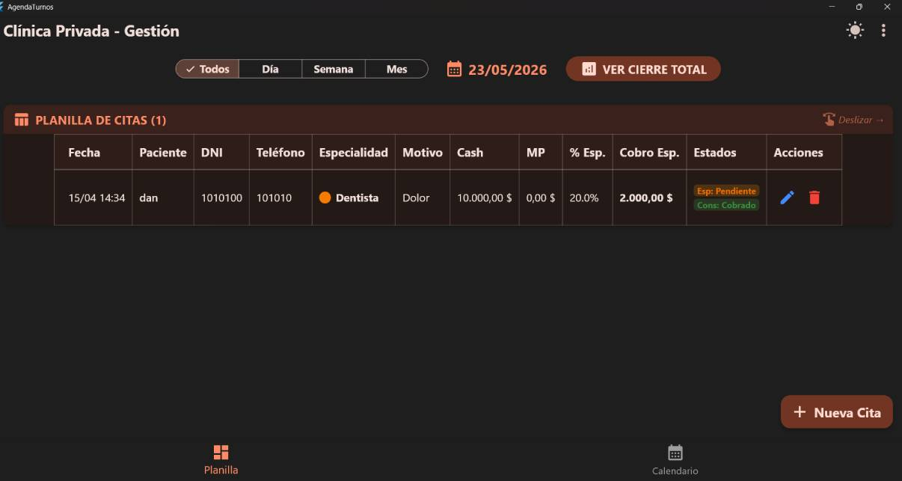
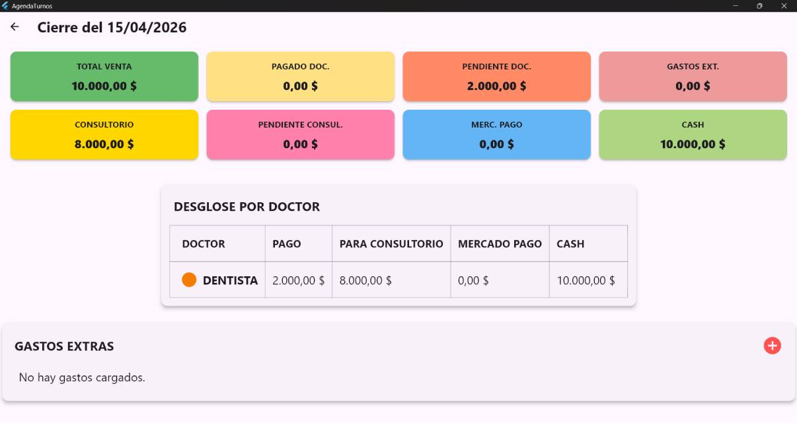

# [AgendaTurnos]

> **Nota de Confidencialidad:** Debido a acuerdos de confidencialidad (NDA) o por tratarse de software de código cerrado, el código fuente original de este repositorio es privado. Por lo tanto este READNE.md es usado para explicar el proyecto, en caso de que lo quiera ver, para luego contratarme, contacteme para poder mostrarlo.

---

## Sobre el Proyecto

[**Contexto:**]
**Una clinica privada me contacto para hacer una app donde se administre los datos de la empresa, en este caso dinero y turnos.**

[**El Problema:**]
**La dueña del local necesita organizarse de una manera más profesional viendo donde se va el dinero, que le queda y el cierre de caja de cada día, más los turnos de los pacientes**

[**La Solución:**]
**Por lo que hice un sistema a la medida de lo pedido para que el usuario administrador (el dueño), pueda ver los turnos que posee, colocarlos, ver el % de ganancia de dinero de la empresa y el medico, luego un resumen de caja diario, semanal, mensual, que se va guardando y se puede ver en cualquier momento y un calendario como forma de ver todo de mejor manera**

---

## Mi Rol y Responsabilidades

Fui el **[Desarrollador Full-Stack /// Full-Stack Developer]** principal y unico de este proyecto, encargado de todo el ciclo de vida, incluyendo:
* Lo que requeria el cliente
* Diseño de la base de datos y la arquitectura.
* Desarrollo de la interfaz de usuario.
* Despliegue en producción.

---

## Stack Tecnológico

* **Frontend:** [Flutter]
* **Backend:** [Recibe en la base de datos los turnos de las personas y las ordena, a través de una operación matematica se resuelve el tema financiero y se le muestra al cliente ya echo]
* **Base de Datos:** [SQL]
* **Otras herramientas:** [Superbase] (use Superbase, al ser una app que no requería de unos servidores muy potentes lo use, además abarataba costos)

---

## Características Principales

* **[Característica 1]:** Una cuenta de administrador donde veía todo lo solicitado
* **[Característica 2]:** Un calendario interactivo completo, con toda la información pedida
* **[Característica 3]:** Servidores gratiutos al ser un sistema facil y no requerir mucha potencia, más un precio economico al ser principiante

---

## 🧠 Desafíos Técnicos y Soluciones

### 1. [Calendario y offline]
* **El Reto:** ¿Qué pasa si en la clínica se corta el internet? Si la app dependiera únicamente de Supabase (la base de datos en la nube), no se podrían cargar ni ver los turnos. Había que lograr que la app funcionara rápido, sin conexión, pero que a la vez sincronizara con la nube cuando el internet volviera.
* **La Solución:**  Se implementó una estrategia Offline-First. Cuando la app inicia (loadData()), primero carga todos los datos desde el almacenamiento local (caché a través de DataService). Esto hace que la app se abra al instante. Luego, en un proceso en segundo plano (background), ejecuta _syncWithSupabase() que verifica si hay red con connectivity_plus. Si hay red, actualiza los datos remotos y trae los nuevos. Las funciones de Guardar/Borrar citas también guardan en el dispositivo primero y luego envían a Supabase de manera silenciosa usando bloques try/catch para no bloquear la pantalla si falla el internet.
* **El Resultado:** La app podria funcionar sin internet.

### 2. [Cálculos Financieros y Agrupación por Médico]
* **El Reto:** En el área contable, tener que calcular cuánto le corresponde a la clínica, cuánto al médico, qué está pendiente, qué se pagó en Efectivo y qué en MercadoPago. Y peor aún, agrupar todo esto por cada especialista de manera automática sin importar si un turno se cargó hace meses o recién. 
* **La Solución:** En lugar de hacer consultas complejas y lentas a la base de datos (SQL), todo se calcula en tiempo de ejecución en el AppState usando getters de Dart (como totalVenta, pendienteMedico, totalMercadoPago). Para agrupar los datos por doctor se creó un mapa maestro (groupedBySpecialty). Este mapa agarra las citas filtradas, normaliza el nombre del médico (ignorando mayúsculas o espacios extra para evitar duplicados por error de tipeo) y va sumando los montos (PAGO, PARA_CONSULTORIO, MP, CASH). Es sumamente rápido porque se procesa en memoria.
* **El Resultado:** Al final se pudo optimizar toda la función.

---

## Demostración Visual

## Vista de la página principal (modo oscuro configurado)

### Vista del cierre de caja (modo claro configurado)

